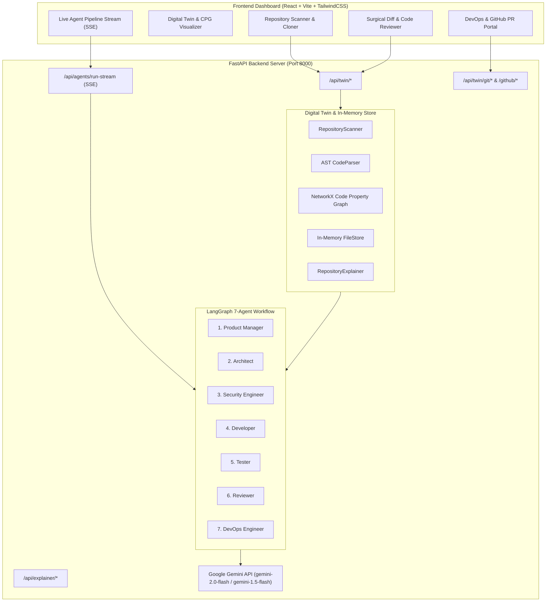
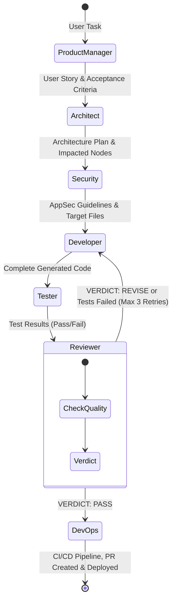

# 🚀 Agentic Digital Twin for Software Engineering (ADT-SE)

[](https://fastapi.tiangolo.com)
[](https://reactjs.org)
[](https://vitejs.dev)
[](https://ai.google.dev/)
[](https://langchain-ai.github.io/langgraph/)
[](https://tailwindcss.com)
[](https://networkx.org/)

> **An Autonomous, Multi-Agent Cognitive Digital Twin Platform for Full-Lifecycle Repository Comprehension, Impact Analysis, Self-Healing Code Synthesis, and Automated CI/CD Deployment.**

---

## 📑 Table of Contents

- [📌 Overview](#-overview)
- [✨ Key Capabilities](#-key-capabilities)
- [🏛️ System Architecture](#️-system-architecture)
- [🤖 The 7-Agent Society](#-the-7-agent-society)
- [🔄 Autonomous Execution Workflow](#-autonomous-execution-workflow)
- [🛠️ Tech Stack](#️-tech-stack)
- [📂 Project Directory Structure](#-project-directory-structure)
- [⚡ Getting Started](#-getting-started)
  - [Prerequisites](#prerequisites)
  - [1. Backend Setup](#1-backend-setup)
  - [2. Frontend Setup](#2-frontend-setup)
  - [3. Environment Configuration](#3-environment-configuration)
- [🌐 API Reference](#-api-reference)
- [🖥️ UI & Workflow Guide](#️-ui--workflow-guide)
- [🛡️ Security, Privacy & Safety](#️-security-privacy--safety)
- [🤝 Contributing & License](#-contributing--license)

---

## 📌 Overview

Traditional LLM coding assistants operate on isolated snippets or single files, lacking global repository context, structural dependencies, security boundaries, and runtime test feedback.

**ADT-SE (Agentic Digital Twin for Software Engineering)** bridges this gap by creating a continuously synchronized **Cognitive Digital Twin** of any target codebase. It dynamically extracts:
- **Abstract Syntax Trees (AST)** for Python, JavaScript, TypeScript, and SQL
- **Symbol Call & Import Graphs** (Functions, Classes, API Routes, Database Models)
- **Folder Roles & Architectural Boundaries**
- **Semantic Code Embeddings & In-Memory Ingestion**

Operating over this Digital Twin is a **7-Agent Society** modeling the complete **Software Development Life Cycle (SDLC)**. Each specialized agent collaborates with upstream context, executes automated test loops, conducts strict peer reviews, and generates ready-to-deploy CI/CD pipelines and GitHub Pull Requests.

---

## ✨ Key Capabilities

1. 🔍 **In-Memory Code Property Graph (CPG)**
   - Ultra-fast (<50ms) graph analysis using NetworkX without external graph database overhead.
   - Traces cross-file imports, function calls, class inheritances, database schemas, and REST endpoints.
   - Calculates **Impact Subgraphs** to identify all downstream components affected by a proposed change.

2. 🧠 **Deep System Comprehension & Explainability Engine**
   - Automatically categorizes folder hierarchies (Frontend, Backend, DevOps, QA, Docs).
   - Detects entry points, tech stack composition, and architectural patterns.
   - Identifies missing configurations, placeholder secrets, and architectural risks.

3. 👥 **Collaborative 7-Agent SDLC Society**
   - **Product Manager**: Generates formal user stories and acceptance criteria.
   - **Architect**: Maps affected folders and produces strict JSON modification manifests.
   - **Security Engineer**: AppSec threat modeling, input validation, and secrets audit.
   - **Developer**: Full-stack code generation with exact folder placement.
   - **Tester**: Syntax validation and automated test execution with feedback loops.
   - **Reviewer**: Staff-level PR code reviews with conditional retry loops.
   - **DevOps**: Automated CI/CD pipeline generation (`.github/workflows/ci.yml`, Dockerfile, docker-compose).

4. 📡 **Live Real-Time SSE Streaming**
   - Real-time Server-Sent Events (SSE) stream agent thoughts, logs, and token-by-token progress to the dashboard.

5. 🛡️ **Interactive Review, Safe Disk Merging & GitHub Integration**
   - Side-by-side diff viewer for inspecting generated vs original code before applying.
   - One-click safe merge to disk with backup creation.
   - Direct Git commit, branch creation, automated push, and GitHub Pull Request (PR) opening.
   - Support for repository forking and remote management.

---

## 🏛️ System Architecture



---

## 🤖 The 7-Agent Society

| Agent | Role | Input | Output / Responsibilities |
|---|---|---|---|
| **1. Product Manager** | Business Analyst & PM | User Task Prompt + File Tree | Formal User Story, Business Context, Acceptance Criteria, Scope Boundaries |
| **2. Architect** | System & Technical Architect | User Story + Code Graph Context | Architecture Summary, Files to Create, Files to Modify, Impacted Subgraphs |
| **3. Security Engineer** | AppSec & Threat Modeler | Architecture Plan + User Story | Threat Model, Injection & Auth Risk Audit, Security Guardrails |
| **4. Developer** | Senior Full-Stack Engineer | Context + Security Specs + Architecture | Complete, production-ready source code with proper folder conventions |
| **5. Tester** | QA Automation Engineer | Generated Code + Test Suite | Static AST syntax checking, unit test runner (`pytest`), validation report |
| **6. Reviewer** | Senior Staff PR Reviewer | Code + Test Results + Specs | Strict PR Review, Code Quality Audit, **Pass/Revise** verdict |
| **7. DevOps Engineer** | Platform & Release Engineer | Modified Repository + Tech Stack | Real CI/CD Workflows (`.github/workflows/ci.yml`), Docker configs, release checklist |

---

## 🔄 Autonomous Execution Workflow

The multi-agent society is orchestrated using **LangGraph StateGraph** with conditional loops:



---

## 🛠️ Tech Stack

### Backend
- **Framework**: FastAPI (Python 3.10+) & Uvicorn
- **Agent Orchestration**: LangGraph StateGraph & LangChain ecosystem
- **LLM Engine**: Google Gemini API (`gemini-2.0-flash`, `gemini-1.5-flash`, `gemini-2.5-flash`)
- **Code Graph**: NetworkX In-Memory Directed Property Graphs
- **AST Parsing**: Python AST, Regular Expressions & Multi-language Code Parsers
- **Git & GitHub**: GitPython, HTTPX, GitHub REST API
- **Embeddings & Vector Store**: ChromaDB

### Frontend
- **Framework**: React 18 (Vite)
- **Styling**: TailwindCSS & PostCSS
- **Icons**: Lucide React
- **Network Visualizer**: Cytoscape.js & React-Cytoscapejs
- **Protocol**: Server-Sent Events (SSE) & RESTful JSON APIs

---

## 📂 Project Directory Structure

```text
c:\Final Year\
├── backend/
│   ├── app/
│   │   ├── agents/                   # 7-Agent Society Implementations
│   │   │   ├── architect.py          # System Architecture & Plan Generator
│   │   │   ├── context_builder.py    # Subgraph & Context Retrieval
│   │   │   ├── developer.py          # Surgical Code Synthesis
│   │   │   ├── devops.py             # CI/CD Pipeline & Deployment Assessment
│   │   │   ├── orchestrator.py       # LangGraph Workflow & Retries Definition
│   │   │   ├── product_manager.py    # User Stories & Acceptance Criteria
│   │   │   ├── reviewer.py           # Staff PR Code Quality Review
│   │   │   ├── security.py           # AppSec Threat Modeling
│   │   │   ├── state.py              # AgentState TypedDict Schema
│   │   │   └── tester.py             # QA Verification & Syntax Auditing
│   │   ├── api/                      # REST & SSE API Endpoints
│   │   │   ├── agent_routes.py       # Synchronous agent execution routes
│   │   │   ├── explainer_routes.py   # System comprehension & metrics API
│   │   │   ├── stream_routes.py      # Real-time SSE streaming pipeline
│   │   │   └── twin_routes.py        # Digital Twin scanning, diff, merge & git
│   │   ├── twin/                     # Digital Twin Core Engine
│   │   │   ├── explainer.py          # Codebase comprehension & folder analyzer
│   │   │   ├── file_store.py         # In-memory file cache & semantic lookup
│   │   │   ├── git_manager.py        # Git branches, commits, diffs & status
│   │   │   ├── graph_builder.py      # NetworkX Code Property Graph (CPG)
│   │   │   ├── parser.py             # Multi-language AST symbol extractor
│   │   │   └── scanner.py            # Recursive repository scanner
│   │   ├── utils/                    # Shared Utilities
│   │   │   ├── ci_cd_generator.py    # Auto-generator for GitHub Actions & Docker
│   │   │   ├── github_api.py         # GitHub API client (fork, push, PR)
│   │   │   └── llm.py                # Gemini LLM caller with key rotation & cache
│   │   └── main.py                   # FastAPI Application Entry Point
│   ├── .env.example                  # Environment template
│   └── requirements.txt              # Python dependencies
│
├── frontend/
│   ├── src/
│   │   ├── App.jsx                   # Main React Dashboard (All tabs & controls)
│   │   ├── index.css                 # TailwindCSS base & custom animations
│   │   └── main.jsx                  # React DOM root mounting
│   ├── index.html                    # Single-page HTML entry point
│   ├── package.json                  # Node.js dependencies & scripts
│   ├── tailwind.config.js            # TailwindCSS configuration
│   └── vite.config.js                # Vite development server & proxy config
│
├── .gitignore                        # Global ignore (secrets, venv, node_modules)
└── README.md                         # Project Documentation
```

---

## ⚡ Getting Started

### Prerequisites
- **Python**: 3.10 or higher
- **Node.js**: 18.x or higher & npm
- **Git**: Installed and available in your terminal
- **Google Gemini API Key**: Free from [Google AI Studio](https://aistudio.google.com)
- **GitHub Personal Access Token** *(Optional)*: Needed only for automated remote push and PR creation.

---

### 1. Backend Setup

```bash
# Navigate to the backend directory
cd backend

# Create a virtual environment
python -m venv venv

# Activate the virtual environment
# On Windows (PowerShell / CMD):
venv\Scripts\activate
# On Linux / macOS:
# source venv/bin/activate

# Install dependencies
pip install -r requirements.txt

# Create your environment configuration file
cp .env.example .env
```

Open `backend/.env` in your editor and provide your Gemini API Key:
```env
GEMINI_API_KEY=your_actual_gemini_api_key_here
PORT=8000
HOST=0.0.0.0
MODEL_NAME=gemini-3.6-flash
```

Start the FastAPI backend server:
```bash
python -m uvicorn app.main:app --reload --port 8000
```
*Backend will start on `http://localhost:8000` (API Docs at `http://localhost:8000/docs`).*

---

### 2. Frontend Setup

In a new terminal window:

```bash
# Navigate to the frontend directory
cd frontend

# Install Node dependencies
npm install

# Start the Vite development server
npm run dev
```

Open your browser and navigate to **`http://localhost:5173`**.

---

### 3. Environment Configuration

| Variable | Required? | Description | Default |
|---|---|---|---|
| `GEMINI_API_KEY` | **Yes** | Primary Google Gemini API key from AI Studio | - |
| `GEMINI_API_KEY_2` | Optional | Secondary API key for automatic key rotation | - |
| `GEMINI_API_KEY_3` | Optional | Tertiary API key for high-throughput concurrency | - |
| `MODEL_NAME` | Optional | Gemini model variant | `gemini-2.0-flash` |
| `LLM_MIN_INTERVAL_SEC`| Optional | Minimum seconds between requests to avoid rate limits | `4` |
| `LLM_CACHE_ENABLED` | Optional | In-memory response caching for duplicate queries | `true` |
| `GITHUB_TOKEN` | Optional | GitHub Personal Access Token (`repo` scope) for Push/PR | - |
| `PORT` | Optional | Port for FastAPI server | `8000` |
| `HOST` | Optional | Bind host address | `0.0.0.0` |

---

## 🌐 API Reference

### 1. Digital Twin & Repository Endpoints (`/api/twin`)
- `POST /api/twin/scan` — Scans local repository path, generates Code Property Graph, and populates FileStore.
- `POST /api/twin/clone` — Clones public/private GitHub repository into dynamic workspace and scans it.
- `GET /api/twin/metadata` — Returns repository metrics, symbol counts, and language breakdown.
- `GET /api/twin/tree` — Returns full directory file tree.
- `GET /api/twin/file?path=...` — Reads raw content of a specific file in the repository.
- `GET /api/twin/graph` — Returns Cytoscape JSON elements of the full Code Property Graph.
- `POST /api/twin/search` — Performs semantic & keyword search across all indexed files.
- `POST /api/twin/merge` — Safely writes generated code modifications directly to disk with backup.

### 2. Autonomous Agent & Streaming Endpoints (`/api/agents`)
- `POST /api/agents/run-stream` — **(SSE Endpoint)** Initiates the 7-Agent SDLC pipeline and streams real-time events (`agent_start`, `agent_log`, `agent_complete`, `pipeline_complete`).
- `POST /api/agents/run` — Synchronous pipeline execution returning complete trajectory logs and artifacts.

### 3. Repository Comprehension (`/api/explainer`)
- `GET /api/explainer/summary` — Full architecture report: domain purpose, folder roles, tech stack, and detected issues.

### 4. Git & GitHub Operations (`/api/twin/git` & `/api/twin/github`)
- `GET /api/twin/git/status` — Returns local Git branch, modified files, remote origin, and GitHub auth status.
- `POST /api/twin/git/commit` — Stages files and creates a local Git commit.
- `POST /api/twin/git/push` — Pushes local branch to remote repository.
- `POST /api/twin/github/pr` — Creates a GitHub Pull Request with automated release notes.
- `POST /api/twin/github/fork` — Automatically forks an upstream repository to the authenticated user's account.

---

## 🖥️ UI & Workflow Guide

1. **Repository Discovery & Digital Twin Initialization**:
   - Enter a local file path (e.g. `c:/Final Year`) or paste a GitHub URL.
   - Click **Scan Repository** to construct the in-memory Code Property Graph and view folder hierarchy.
   - Explore the **AI Architecture Walkthrough**, review detected entry points, and examine security alerts.

2. **Executing an Autonomous SDLC Task**:
   - Navigate to the **Pipeline** tab.
   - Enter a feature request or bugfix prompt (e.g. *"Implement user authentication with JWT, input validation, and secure password hashing"*).
   - Click **Run 7-Agent Pipeline** to watch the agents collaborate in real time with live logs and state transitions.

3. **Surgical Diff Inspection & Safe Merging**:
   - Inspect the generated files side-by-side with original code.
   - Click **Merge Changes to Disk** to update your repository files safely.

4. **One-Click Release & GitHub PR**:
   - Select your deploy mode: **Direct Commit & Push** or **Create GitHub Pull Request**.
   - Review the auto-generated CI/CD workflow YAML (`.github/workflows/ci.yml`).
   - Click **Deploy** to push code and create the PR on GitHub.

---

## 🛡️ Security, Privacy & Safety

- **Zero Secret Leaks**: The root `.gitignore` guarantees that `.env`, `.venv`, and temporary test workspaces are never tracked or pushed to remote repositories.
- **Sandboxed Execution**: AST compilation and syntax validation run locally prior to merging.
- **Non-Destructive Modifications**: Merging creates file-level backups before overwriting existing source files.

---

## 🤝 Contributing & License

Contributions, issues, and feature requests are welcome!

1. Fork the repository (`https://github.com/Sanwar09/ADE_SE`).
2. Create your feature branch (`git checkout -b feature/amazing-feature`).
3. Commit your changes (`git commit -m "Add amazing feature"`).
4. Push to the branch (`git push origin feature/amazing-feature`).
5. Open a Pull Request.

Distributed under the **MIT License**. See `LICENSE` for more information.
